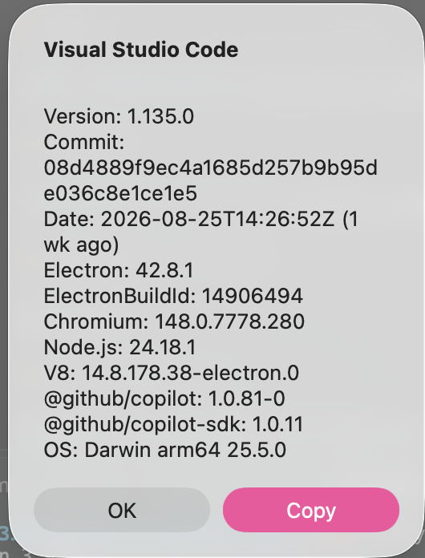

# Init IS310 Homework

## Proof of Installation

1. Python

2. Git

3. VS Code

4. Hypothesis Username

gavinwang

5. AI Tool/Workflow

I plan to use ChatGPT and Codex as part of my AI workflow this semester. I will use these tools to help troubleshoot code, explain concepts, and help with debugging and documentation.